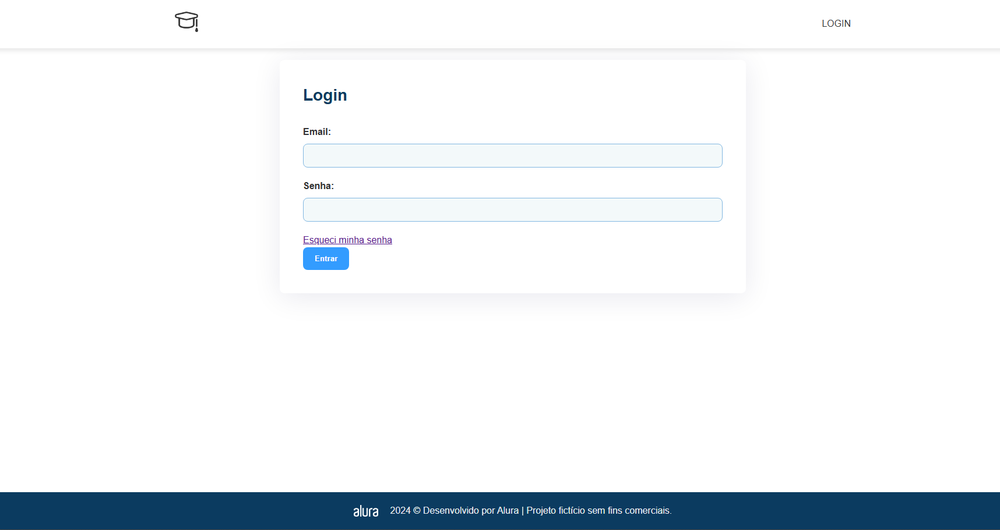
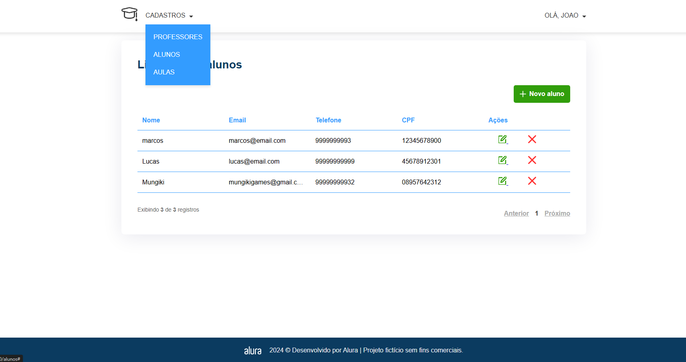

# 🎓 Find Class

Sistema Web desenvolvido com **Java + Spring Boot** para gerenciamento de **Professores, Alunos e Aulas**, com autenticação via Spring Security, controle de perfis de usuário e recuperação de senha com token aleatório enviado por e-mail.

O sistema foi desenvolvido aplicando boas práticas como:

- Arquitetura em camadas
- Uso de DTO (Data Transfer Object)
- Criptografia de senha com BCrypt
- Controle de acesso com Spring Security
- Recuperação de senha com token aleatório e expiração
- Integração com banco de dados MySQL

---

### 👨‍🏫 Home

---

### 🔐 Tela de Login

---

### 📊 Dashboard

---

## 🛠️ Tecnologias Utilizadas

- Java 17+
- Spring Boot
- Spring Security
- Spring Data JPA
- MySQL
- Spring Mail
- Maven
- REST API

---

## 🔐 Perfis de Usuário

| Perfil        | Permissões |
|--------------|------------|
| ATENDENTE    | Gerencia professores, alunos e aulas |
| PROFESSOR    | Visualiza e gerencia suas aulas |
| ALUNO        | Visualiza suas próprias aulas |

---

## 🛡️ Segurança Implementada

- BCryptPasswordEncoder
- Controle de acesso por roles
- Proteção de endpoints
- Token aleatório com expiração
- Validação com Bean Validation
- Separação via DTO

---

## 🏗️ Arquitetura do Projeto
- controller
- service
- repository
- entity
- dto
- config
- security

---

## ⚙️ Configurações do projeto

No arquivo `application.properties`:

## ▶️ Como Executar o Projeto
``mvn spring-boot:run``

Aplicação disponível em:

``http://localhost:8080``
